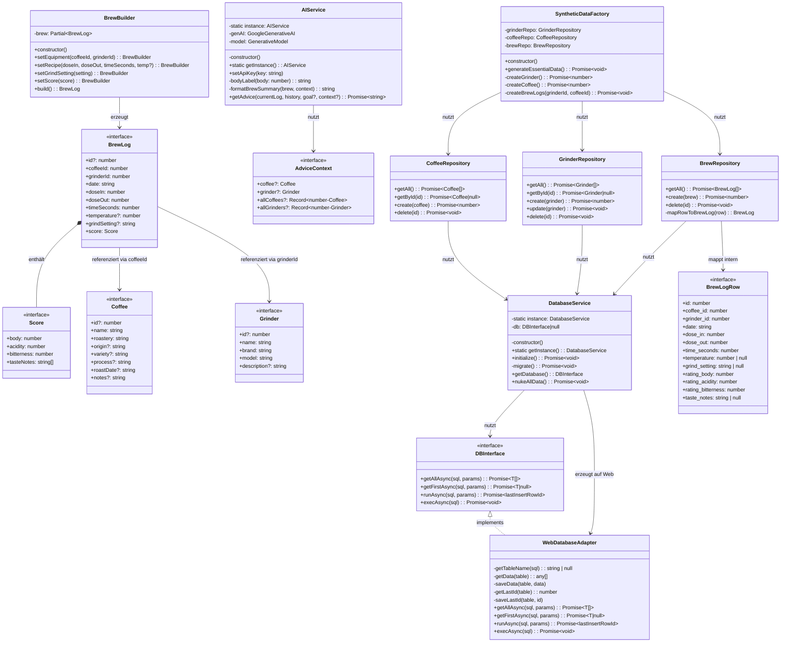
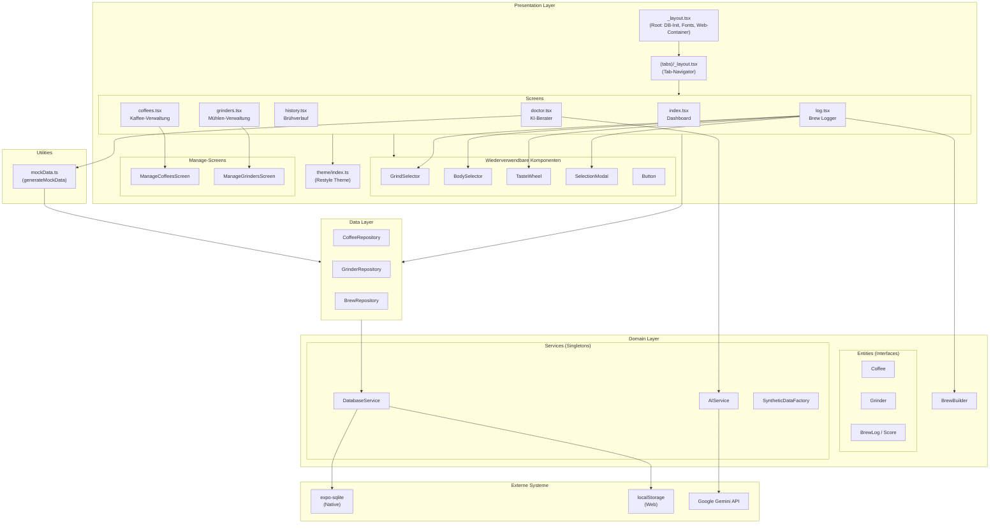
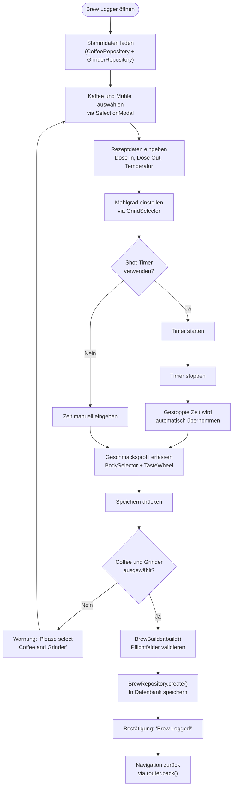
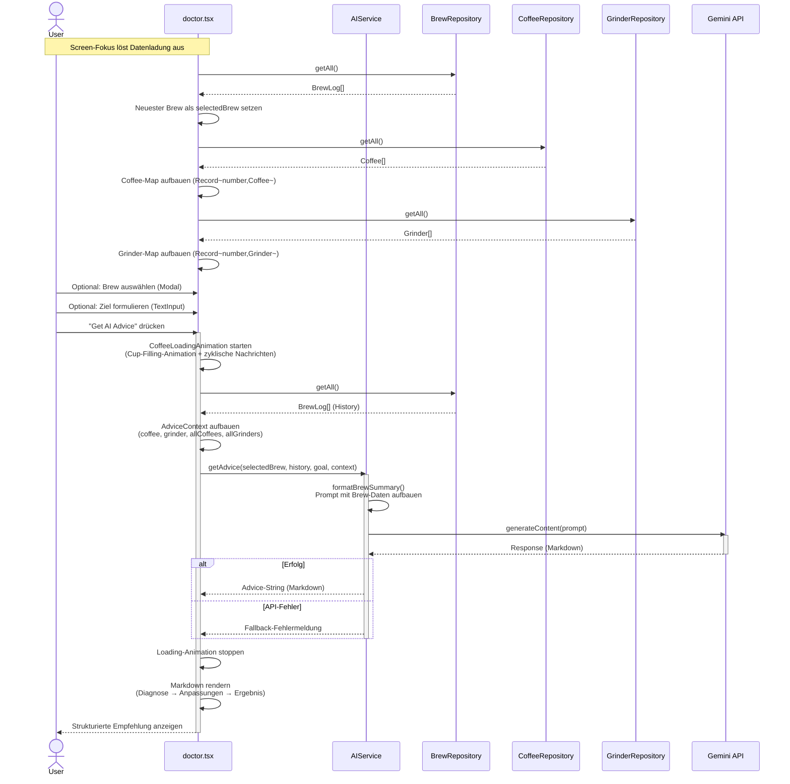

## 6. UML-Diagramme

### 6.1 Klassendiagramm

Das Klassendiagramm zeigt alle relevanten Klassen und Interfaces der Anwendung mit ihren Beziehungen. Die Entities (`Coffee`, `Grinder`, `BrewLog`, `Score`) sind als Interfaces modelliert, die Services als Singletons, und die Repositories als Datenzugriffsschicht.

### 6.2 Komponentendiagramm

Das Komponentendiagramm visualisiert die Schichtenarchitektur und die Abhängigkeiten zwischen den Komponenten sowie zu externen Systemen.

### 6.3 Aktivitätsdiagramm — Brew Logging

Das Aktivitätsdiagramm modelliert den vollständigen Ablauf eines Brew-Logging-Vorgangs durch den Benutzer von der Eingabe bis zur Persistierung.

### 6.4 Sequenzdiagramm — KI-Brühberatung

Das Sequenzdiagramm zeigt die Interaktion zwischen den beteiligten Klassen bei der Anforderung einer KI-basierten Brühberatung.

