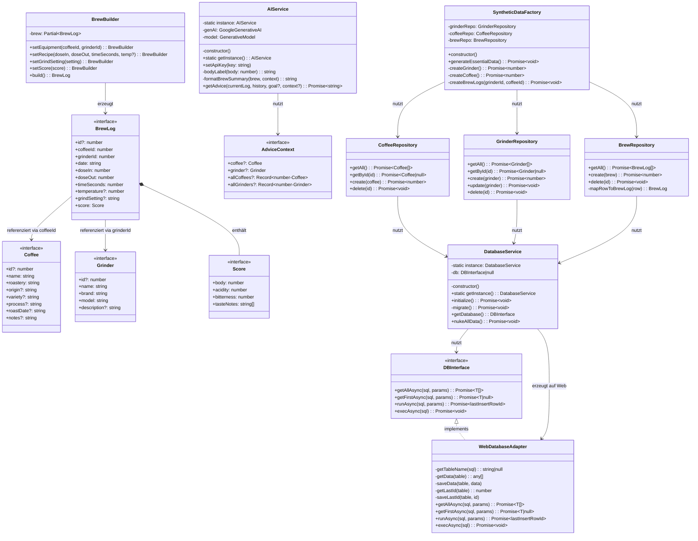
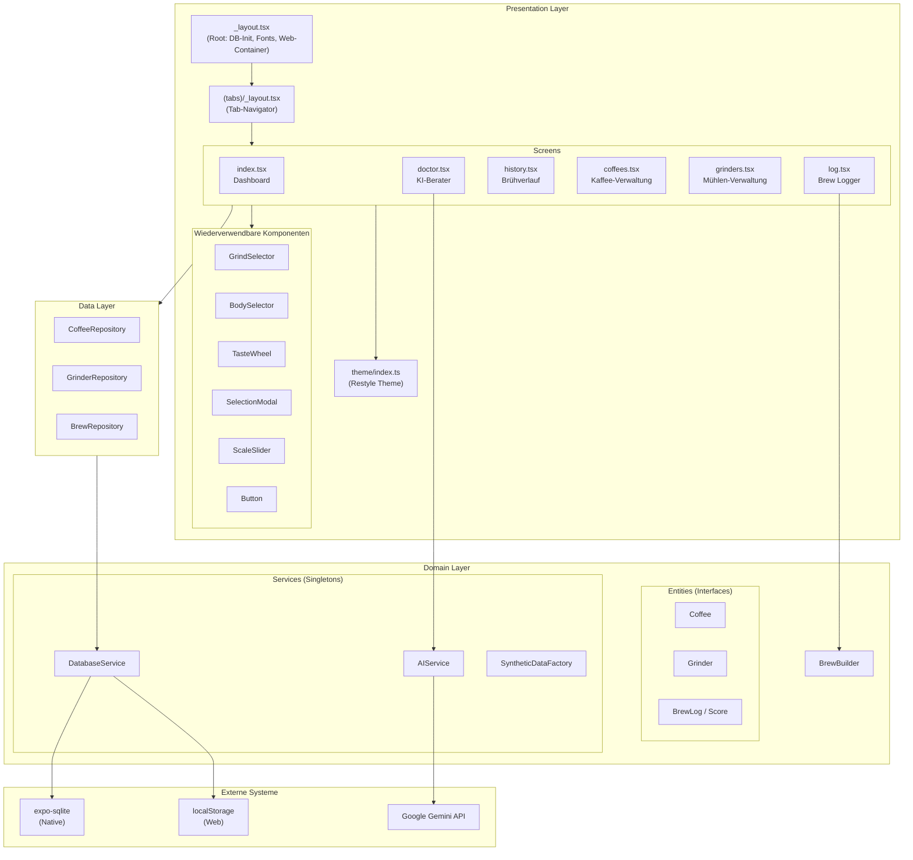
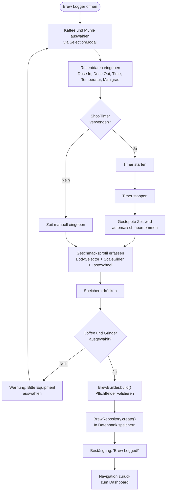
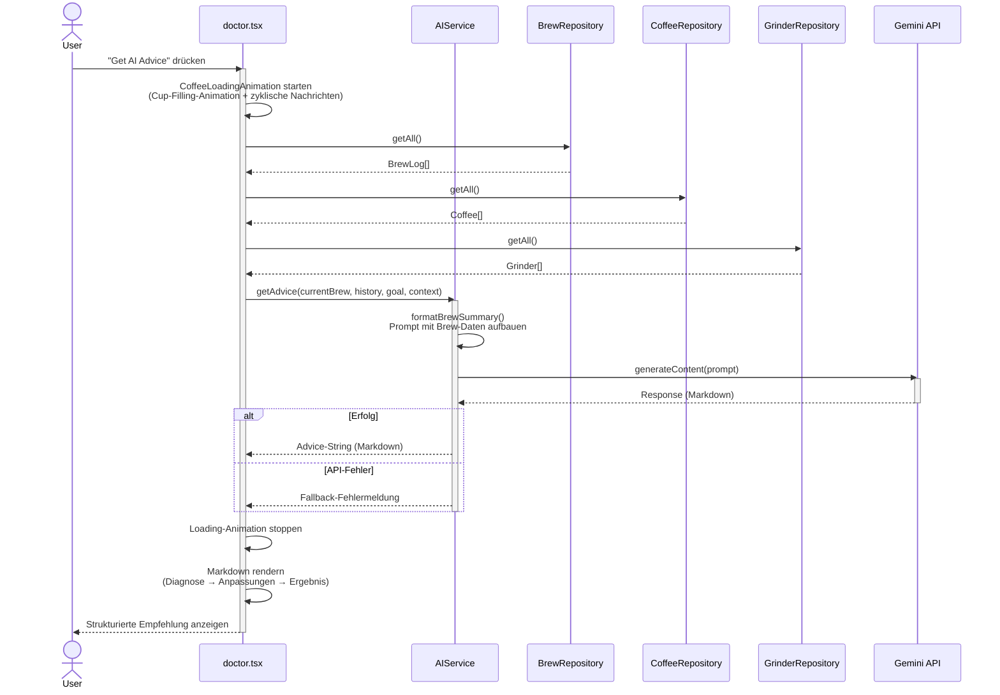

# BrewRef — Dokumentation
– Max Zeitler (8403711), Elena Solodova (9388442), Zoe Bedé (1878920)

> **Projekttyp:** Mobile App (Cross-Plattform)  
> **Technologie:** Expo / React Native / TypeScript  
> **Plattformen:** iOS · Android · Web  

---

## Inhaltsverzeichnis

1. [Einleitung](#1-einleitung)
2. [Technologie-Stack](#2-technologie-stack)
3. [Projektstruktur](#3-projektstruktur)
4. [Anforderungen](#4-anforderungen)
5. [Architektur und Design Patterns](#5-architektur-und-design-patterns)
6. [UML-Diagramme](#6-uml-diagramme)
7. [Umsetzung der UI-Prinzipien nach Nielsen](#7-umsetzung-der-ui-prinzipien-nach-nielsen)
8. [Testfälle](#8-testfälle)
9. [Installation und Ausführung](#9-installation-und-ausführung)

---

## 1. Einleitung

### 1.1 Motivation

Specialty Coffee hat in den letzten Jahren eine enorme Verbreitung erfahren. Home-Baristas investieren in hochwertige Mühlen, Espressomaschinen und sortenreine Bohnen — doch die **systematische Erfassung und Auswertung** ihrer Brühversuche erfolgt häufig nur handschriftlich oder gar nicht. Ohne strukturierte Daten lassen sich Extraktionsprobleme schwer nachvollziehen und Verbesserungen nur zufällig erzielen.

### 1.2 Zielsetzung

**BrewRef** löst dieses Problem durch eine Cross-Plattform-App, die den gesamten Workflow eines Espresso-Zubereitungsprozesses digital abbildet:

- **Erfassung** von Rezeptdaten, Sensorik und Equipment pro Brühvorgang
- **Verwaltung** von Kaffeebohnen und Mühlen als wiederverwendbare Stammdaten
- **Analyse** durch einen KI-basierten Brew Doctor, der auf Basis der konkreten Brühdaten Optimierungsvorschläge generiert
- **Visualisierung** von Statistiken und Brühverlauf auf einem Dashboard

Die App folgt dem Designkonzept **„Industrial Zen"** — eine dunkle, minimalistische Ästhetik mit warmen Espresso-Akzentfarben, die eine ruhige und fokussierte Benutzererfahrung erzeugt.

### 1.3 Funktionsumfang

| Bereich | Funktionen |
|---|---|
| Brew Logging | Rezeptparameter (Dose, Yield, Time, Temp, Grind), Shot-Timer, Geschmacksprofil (Body, Acidity, Bitterness, Taste Notes) |
| Stammdaten | CRUD-Operationen für Kaffeebohnen und Mühlen |
| Analyse | KI-Berater (Gemini), strukturierte Diagnose mit Anpassungsempfehlungen |
| Dashboard | Statistiken (Beans Stashed, Total Brews, Top Coffee), Last-Brew-Karte |
| Plattform | iOS, Android, Web aus einer Codebasis |

---

## 2. Technologie-Stack

| Komponente | Technologie | Begründung |
|---|---|---|
| Framework | Expo SDK 54, React Native 0.81, TypeScript | Cross-Plattform aus einer Codebasis; TypeScript für Typsicherheit |
| Navigation | Expo Router v6 | Dateibasiertes Routing, vergleichbar mit Next.js |
| Design System | Shopify Restyle | Theme-basiertes Styling mit typsicheren Tokens |
| Datenbank | `expo-sqlite` (nativ) / `localStorage` (Web) | Lokale Persistenz ohne Backend; Adapter-Pattern für Plattformunabhängigkeit |
| KI-Integration | Google Generative AI (Gemini 3 Flash Preview) | Kontextbasierte Analyse von Brühdaten |
| Typografie | Inter, JetBrains Mono via `expo-font` | Inter für UI-Text, JetBrains Mono für numerische Werte |
| Grafiken | `react-native-svg` | Vektorgrafik-Rendering für das Taste Wheel |
| Animationen | `react-native-reanimated`, `Animated` API | Performante UI-Animationen (GrindSelector-Snap, Cup-Filling) |
| Haptik | `expo-haptics` | Haptisches Feedback bei Interaktionen (nur nativ) |
| Gestensteuerung | `react-native-gesture-handler` | Swipe-to-Delete auf Listeneinträgen |

---

## 3. Projektstruktur

Das Projekt folgt einer klaren Schichtentrennung. Die Ordnerstruktur spiegelt die logische Architektur wider:

```
Coffee-app/
├── app/                          # Navigation Layer (Expo Router)
│   ├── _layout.tsx               # Root-Layout: DB-Init, Font-Loading, Web-Container
│   └── (tabs)/
│       ├── _layout.tsx           # Tab-Navigator (6 Tabs)
│       ├── index.tsx             # Home / Dashboard
│       ├── log.tsx               # Brew Logger
│       ├── history.tsx           # Brühverlauf
│       ├── coffees.tsx           # Kaffee-Verwaltung
│       ├── grinders.tsx          # Mühlen-Verwaltung
│       └── doctor.tsx            # KI-Berater (Brew Doctor)
│
└── src/
    ├── presentation/             # UI-Schicht
    │   ├── theme/index.ts        # Shopify Restyle Theme (Farben, Fonts, Spacing)
    │   ├── components/           # Wiederverwendbare UI-Komponenten
    │   │   ├── GrindSelector     # Scrollbarer Mahlgrad-Selector mit Snap
    │   │   ├── BodySelector      # Body-Auswahl (Light / Medium / Heavy)
    │   │   ├── TasteWheel        # SVG-Geschmacksrad (6 Kategorien)
    │   │   ├── SelectionModal    # Bottom-Sheet Auswahl-Modal
    │   │   ├── ScaleSlider       # Gradient-Slider (0–10)
    │   │   └── Button            # Theme-basierter Button
    │   └── screens/              # Vollbild-Komponenten (Manage-Screens)
    │       ├── ManageCoffeesScreen
    │       └── ManageGrindersScreen
    │
    ├── domain/                   # Domänen- / Geschäftslogik-Schicht
    │   ├── entities/             # Datenmodelle (TypeScript-Interfaces)
    │   │   ├── Coffee.ts         # Kaffeebohnen-Interface
    │   │   ├── Grinder.ts        # Mühlen-Interface
    │   │   └── BrewLog.ts        # Brühvorgang-Interface inkl. Score
    │   ├── services/
    │   │   ├── DatabaseService   # Singleton – DB-Verwaltung + Web-Adapter
    │   │   ├── AIService         # Singleton – Gemini-API-Client
    │   │   └── SyntheticDataFactory  # Factory für Seed-/Testdaten
    │   └── builders/
    │       └── BrewBuilder       # Builder-Pattern für BrewLog-Objekte
    │
    ├── data/                     # Datenzugriffs-Schicht
    │   └── repositories/
    │       ├── CoffeeRepository  # CRUD für coffees-Tabelle
    │       ├── GrinderRepository # CRUD für grinders-Tabelle
    │       └── BrewRepository    # CRUD für brew_logs-Tabelle
    │
    └── utils/
        └── mockData.ts           # Generierung von Testdaten
```

---

## 4. Anforderungen

### 4.1 Funktionale Anforderungen

| ID | Anforderungstyp | Beschreibung |
|---|---|---|
| FA1 | Funktional | **Brew Logging** — Vollständige Erfassung eines Brühvorgangs mit Rezeptparametern (Dose In, Dose Out, Extraktionszeit, Temperatur, Mahlgrad). Der `BrewBuilder` validiert alle Pflichtfelder beim Speichern. |
| FA2 | Funktional | **Kaffee-Verwaltung (CRUD)** — Anlegen, Anzeigen und Löschen von Kaffeebohnen mit Metadaten (Herkunft, Sorte, Aufbereitungsverfahren, Röstdatum). Umgesetzt durch `ManageCoffeesScreen` und `CoffeeRepository`. |
| FA3 | Funktional | **Mühlen-Verwaltung (CRUD)** — Anlegen, Anzeigen, Bearbeiten und Löschen von Kaffeemühlen mit Marke, Modell und Beschreibung. Umgesetzt durch `ManageGrindersScreen` und `GrinderRepository`. |
| FA4 | Funktional | **Brühverlauf** — Chronologische Anzeige aller gespeicherten Brühvorgänge mit Detail-Modal und Löschfunktion (Swipe-to-Delete). Umgesetzt in `history.tsx`. |
| FA5 | Funktional | **KI-basierte Brühberatung** — Analyse eines ausgewählten Brühvorgangs durch Gemini-KI inklusive frei formulierbarer Zielstellung. Antwort in strukturiertem Format: Diagnose → Anpassungen (max. 3) → Erwartetes Ergebnis. Umgesetzt in `doctor.tsx` und `AIService`. |
| FA6 | Funktional | **Shot-Timer** — Integrierter Timer mit Start-, Stop- und Reset-Funktion bei 0,1-Sekunden-Genauigkeit. Die gestoppte Zeit wird automatisch in das Rezeptfeld übernommen. Umgesetzt in `log.tsx`. |
| FA7 | Funktional | **Geschmacksprofil-Erfassung** — Mehrdimensionale sensorische Bewertung: Body-Auswahl über 3 Zonen (Light/Medium/Heavy), Acidity- und Bitterness-Slider (0–10), sowie Taste Wheel mit 6 Kategorien und Sub-Notes. Umgesetzt durch `BodySelector`, `ScaleSlider` und `TasteWheel`. |
| FA8 | Funktional | **Dashboard mit Statistiken** — Übersichtsseite mit Kennzahlen (Beans Stashed, Days Since Last Brew, Total Brews, Top Coffee) und detaillierter Last-Brew-Karte. Umgesetzt in `index.tsx`. |

### 4.2 Nicht-funktionale Anforderungen

| ID | Anforderungstyp | Beschreibung |
|---|---|---|
| NFA1 | Nicht-funktional | **Cross-Plattform-Fähigkeit** — Die App läuft auf iOS, Android und Web aus einer einzigen Codebasis. Plattformspezifische Unterschiede werden durch den `WebDatabaseAdapter` (Adapter-Pattern) und `Platform.OS`-Abfragen in Layout und Dialogen abstrahiert. |
| NFA2 | Nicht-funktional | **Offline-First** — Alle Kernfunktionen arbeiten ohne Internetverbindung. Daten werden lokal persistiert (`expo-sqlite` auf nativen Plattformen, `localStorage` im Web). Lediglich die KI-Beratung erfordert eine Online-Verbindung. |
| NFA3 | Nicht-funktional | **Responsiveness und Performance** — Flüssige Interaktionen durch haptisches Feedback (`expo-haptics`), Snap-Animationen (`snapToInterval`, `decelerationRate="fast"`), Custom Loading-Animationen (animiertes Cup-Filling via `Animated` API) und optimierte Scroll-Performance (`scrollEventThrottle={16}`). |

---

## 5. Architektur und Design Patterns

### 5.1 Schichtenarchitektur (Layered Architecture)

Die Anwendung ist in eine **Drei-Schichten-Architektur** gegliedert, wobei die Abhängigkeitsrichtung strikt eingehalten wird:

```
┌─────────────────────────────────────────────────┐
│  Presentation Layer (UI)                        │
│  app/, src/presentation/                        │
│  Screens, Components, Theme, Navigation         │
├─────────────────────────────────────────────────┤
│  Domain Layer (Geschäftslogik)                  │
│  src/domain/                                    │
│  Entities (Interfaces), Services, Builders      │
├─────────────────────────────────────────────────┤
│  Data Layer (Datenzugriff)                      │
│  src/data/                                      │
│  Repositories → DatabaseService                 │
└─────────────────────────────────────────────────┘
```

**Abhängigkeitsrichtung:** Presentation → Domain ← Data.  
Die Domain-Schicht definiert die Entities als reine TypeScript-Interfaces ohne Abhängigkeiten zu UI- oder Datenbankdetails — sie bildet den stabilen Kern der Anwendung.

Ergänzend wird das **Repository-Pattern** als Architekturmuster eingesetzt. Die Klassen `CoffeeRepository`, `GrinderRepository` und `BrewRepository` kapseln sämtliche SQL-Logik und exponieren eine einheitliche API (`getAll()`, `getById()`, `create()`, `delete()`), sodass die Screens ausschließlich über diese Abstraktionsschicht auf Daten zugreifen.

### 5.2 Design Patterns

Im Folgenden werden die vier eingesetzten Design Patterns dokumentiert.

#### 5.2.1 Singleton Pattern

Das **Singleton Pattern** wurde für die zentrale Ressourcenverwaltung eingesetzt und mithilfe der Klassen `DatabaseService` und `AIService` umgesetzt. Beide verwenden eine private `constructor`-Methode und eine statische `getInstance()`-Methode, die sicherstellt, dass zur Laufzeit nur eine einzige Instanz existiert.

**Begründung:** Es darf nur eine Datenbankverbindung und ein KI-API-Client existieren, um Ressourcenkonflikte und inkonsistente Zustände zu vermeiden.

```typescript
class DatabaseService {
    private static instance: DatabaseService;
    private db: DBInterface | null = null;
    private constructor() { }

    public static getInstance(): DatabaseService {
        if (!DatabaseService.instance) {
            DatabaseService.instance = new DatabaseService();
        }
        return DatabaseService.instance;
    }
}
export const databaseService = DatabaseService.getInstance();
```

#### 5.2.2 Builder Pattern

Das **Builder Pattern** wurde für die schrittweise Konstruktion komplexer `BrewLog`-Objekte eingesetzt und mithilfe der Klasse `BrewBuilder` umgesetzt. Der Builder bietet eine Fluent-API mit den Methoden `setEquipment()`, `setRecipe()`, `setGrindSetting()` und `setScore()`. Beim Aufruf von `build()` werden alle Pflichtfelder validiert, bevor das finale Objekt erzeugt wird.

**Begründung:** Ein `BrewLog` besitzt sowohl Pflicht- als auch optionale Felder. Der Builder trennt die Konstruktion von der Repräsentation und stellt sicher, dass nur valide Objekte erzeugt werden.

```typescript
const brew = new BrewBuilder()
    .setEquipment(coffeeId, grinderId)
    .setRecipe(18, 36, 30, 93)
    .setGrindSetting('22 Clicks')
    .setScore({ body: 1, acidity: 7, bitterness: 3, tasteNotes: ['Jasmine'] })
    .build(); // → Validierung + Datum-Erzeugung
```

#### 5.2.3 Adapter Pattern

Das **Adapter Pattern** wurde für die plattformübergreifende Datenbankabstraktion eingesetzt und mithilfe des Interface `DBInterface` sowie der Klasse `WebDatabaseAdapter` umgesetzt. Der Adapter implementiert dasselbe Interface wie die native `expo-sqlite`-Instanz, übersetzt die Aufrufe jedoch intern auf `localStorage`-Operationen.

**Begründung:** Die Web-Plattform unterstützt kein `expo-sqlite`. Durch den Adapter können alle Repositories plattformunabhängig arbeiten, ohne Kenntnis der zugrunde liegenden Speichertechnologie.

```typescript
interface DBInterface {
    getAllAsync<T>(sql: string, params?: any[]): Promise<T[]>;
    getFirstAsync<T>(sql: string, params?: any[]): Promise<T | null>;
    runAsync(sql: string, params?: any[]): Promise<{ lastInsertRowId: number }>;
    execAsync(sql: string): Promise<void>;
}

class WebDatabaseAdapter implements DBInterface {
    // Intern: localStorage-basierte Implementierung
    async getAllAsync<T>(sql: string, params: any[] = []): Promise<T[]> { /* ... */ }
    // ...
}
```

#### 5.2.4 Factory Pattern

Das **Factory Pattern** wurde für die Erzeugung konsistenter Testdaten eingesetzt und mithilfe der Klasse `SyntheticDataFactory` umgesetzt. Die Methode `generateEssentialData()` erzeugt zusammenhängende Entitäten (Grinder → Coffee → BrewLogs) in der korrekten Reihenfolge, sodass alle Fremdschlüssel-Beziehungen gewahrt bleiben.

**Begründung:** Die Factory kapselt die Erzeugungslogik für zusammenhängende Entitäten und stellt die referenzielle Integrität der Seed-Daten sicher.

```typescript
class SyntheticDataFactory {
    async generateEssentialData(): Promise<void> {
        const grinderId = await this.createGrinder();   // Comandante C40
        const coffeeId  = await this.createCoffee();    // Ethiopia Yirgacheffe
        await this.createBrewLogs(grinderId, coffeeId); // Sample Brews
    }
}
```

---

## 6. UML-Diagramme

### 6.1 Klassendiagramm

Das Klassendiagramm zeigt alle relevanten Klassen und Interfaces der Anwendung mit ihren Beziehungen. Die Entities (`Coffee`, `Grinder`, `BrewLog`, `Score`) sind als Interfaces modelliert, die Services als Singletons, und die Repositories als datenzugriffsschicht.



### 6.2 Komponentendiagramm

Das Komponentendiagramm visualisiert die Schichtenarchitektur und die Abhängigkeiten zwischen den Komponenten sowie zu externen Systemen.



### 6.3 Aktivitätsdiagramm — Brew Logging

Das Aktivitätsdiagramm modelliert den vollständigen Ablauf eines Brew-Logging-Vorgangs durch den Benutzer von der Eingabe bis zur Persistierung.



### 6.4 Sequenzdiagramm — KI-Brühberatung

Das Sequenzdiagramm zeigt die Interaktion zwischen den beteiligten Klassen bei der Anforderung einer KI-basierten Brühberatung.



---

## 7. Umsetzung der UI-Prinzipien nach Nielsen

Die Benutzeroberfläche wurde systematisch anhand der **zehn Usability-Heuristiken nach Jakob Nielsen** gestaltet. Im Folgenden wird für jede Heuristik dokumentiert, wie sie in der Anwendung konkret umgesetzt wird.

### 7.1 Sichtbarkeit des Systemstatus

Der Benutzer wird zu jedem Zeitpunkt über den aktuellen Zustand der Anwendung informiert.

| Umsetzung | Datei |
|---|---|
| `ActivityIndicator` während DB-Initialisierung und Font-Loading | `_layout.tsx` |
| `RefreshControl` mit Pull-to-Refresh auf Dashboard und History | `index.tsx`, `history.tsx` |
| Shot-Timer mit Echtzeit-Sekundenanzeige (Aktualisierung alle 100ms) | `log.tsx` |
| Custom Coffee-Cup-Filling-Animation mit zyklischen Statusnachrichten während KI-Verarbeitung | `doctor.tsx` |
| Bestätigungsmeldungen nach erfolgreichen Aktionen ("Brew Logged!", "Data Generated!") | `log.tsx`, `doctor.tsx` |

### 7.2 Übereinstimmung zwischen System und realer Welt

Die App verwendet konsequent die **Fachterminologie der Kaffee-Domäne**, um einen nahtlosen Übergang zwischen physischem Workflow und digitaler Erfassung zu schaffen.

| Umsetzung | Datei |
|---|---|
| Domänenspezifische Begriffe: Dose In/Out, Grind Setting, Body, Acidity, Shot Timer | Alle Logging-Screens |
| Taste Wheel mit branchenüblichen Kategorien (Fruity, Sweet, Nutty, Spiced, Roasted, Floral) | `TasteWheel.tsx` |
| Body-Zonen mit sensorischen Deskriptoren: "WATERY", "TEA-LIKE", "SYRUPY", "VELVETY" | `BodySelector.tsx` |
| GrindSelector als physische Skala (Tick-Lineal) — imitiert die Einstellung realer Kaffeemühlen | `GrindSelector.tsx` |

### 7.3 Benutzerkontrolle und Freiheit

Dem Benutzer wird jederzeit die Möglichkeit gegeben, Aktionen rückgängig zu machen oder den aktuellen Kontext zu verlassen.

| Umsetzung | Datei |
|---|---|
| Tab-Navigation erlaubt freies Wechseln zwischen allen Bereichen | `(tabs)/_layout.tsx` |
| Modals: Close-Button und Backdrop-Tap zum Schließen | `SelectionModal.tsx`, `history.tsx` |
| Shot-Timer: Start/Stop/Reset — volle Kontrolle über den Timer | `log.tsx` |
| Automatische Navigation nach Speichern (`router.back()`) | `log.tsx` |
| Löschen von Brews, Coffees, Grinders jederzeit möglich | `history.tsx`, Manage-Screens |

### 7.4 Konsistenz und Standards

Ein globales Theme-System stellt sicher, dass alle UI-Elemente einheitlich gestaltet sind.

| Umsetzung | Datei |
|---|---|
| Zentrales Theme mit Farben, Spacing, Font-Familien und Text-Varianten | `theme/index.ts` |
| Einheitliche Kartenstile (`cardPrimaryBackground`, `borderRadius`) auf allen Screens | Alle Screens |
| Konsistente Modale (Dark-Theme, Animationsart `slide`) | `SelectionModal`, Manage-Screens |
| Tab-Icons aus konsistenter Icon-Familie (MaterialCommunityIcons, MaterialIcons) | `(tabs)/_layout.tsx` |
| Swipe-to-Delete identisch auf Coffees und Grinders implementiert | `ManageCoffeesScreen`, `ManageGrindersScreen` |

### 7.5 Fehlervermeidung

Durch Validierung, Default-Werte und Bestätigungsdialoge werden Benutzerfehler systematisch verhindert.

| Umsetzung | Datei |
|---|---|
| `BrewBuilder.build()` validiert alle Pflichtfelder vor Speicherung | `BrewBuilder.ts` |
| Warnung bei fehlendem Equipment ("Please select Coffee and Grinder") | `log.tsx` |
| `GrindSelector` mit `snapToInterval` verhindert ungültige Zwischenwerte | `GrindSelector.tsx` |
| Sinnvolle Default-Werte für Rezeptfelder (18g / 36g / 30s / 93°C) | `log.tsx` |
| Plattformspezifische Bestätigungsdialoge vor destruktiven Aktionen (`Alert.alert()` nativ, `confirm()` Web) | `history.tsx`, `doctor.tsx` |

### 7.6 Wiedererkennen statt Erinnern

Alle relevanten Informationen und Optionen werden direkt sichtbar dargestellt — der Benutzer muss sich nichts merken.

| Umsetzung | Datei |
|---|---|
| `SelectionModal` zeigt alle verfügbaren Coffees/Grinders als scrollbare Liste | `SelectionModal.tsx` |
| Ausgewähltes Equipment wird im Selector-Feld angezeigt | `log.tsx` |
| Taste Wheel zeigt alle 6 Geschmackskategorien visuell auf einen Blick | `TasteWheel.tsx` |
| Body-Selector zeigt alle drei Optionen gleichzeitig mit Deskriptoren | `BodySelector.tsx` |
| History-Cards zeigen Kaffee, Datum, Rezeptdaten und Geschmacksnotizen direkt an | `history.tsx` |

### 7.7 Flexibilität und Effizienz

Die App bietet sowohl einfache Bedienung für Einsteiger als auch Abkürzungen für erfahrene Benutzer.

| Umsetzung | Datei |
|---|---|
| Shot-Timer füllt das Zeitfeld automatisch aus (kein manuelles Tippen nötig) | `log.tsx` |
| Pull-to-Refresh für schnelle Aktualisierung auf Dashboard und History | `index.tsx`, `history.tsx` |
| GrindSelector: Scroll-Interaktion mit Snap und manuelle Texteingabe möglich | `GrindSelector.tsx` |
| Brew Doctor: Brew-Auswahl aus der Verlaufsliste + frei formulierbares Ziel | `doctor.tsx` |
| Dev Tools: "Generate 50 Mock Brews" und "Nuke All Data" zum schnellen Testen | `doctor.tsx` |

### 7.8 Ästhetisches und minimalistisches Design

Die UI folgt dem Designkonzept **"Industrial Zen"** — jeder Screen zeigt nur kontextuell relevante Informationen.

| Umsetzung | Datei |
|---|---|
| "Industrial Zen"-Farbpalette: Onyx (#0E0E0E), Graphite (#1A1A1A), Espresso-Amber (#D4943A), Bronze (#DBA04D), Sage (#8F9779) | `theme/index.ts` |
| Custom Typografie: Inter (Regular/SemiBold/Bold) für UI-Text, JetBrains Mono für numerische Werte | `theme/index.ts`, `_layout.tsx` |
| Dashboard: verdichtete Statistiken in 2×2-Grid + fokussierter Last-Brew-Card | `index.tsx` |
| Web: Phone-Frame-Container (max. 500px, abgerundete Ecken, subtiler Schatten) | `_layout.tsx` |
| Sparsamer Einsatz der Akzentfarbe Espresso-Amber — nur für aktive/wichtige Elemente | Konsequent im Theme |

### 7.9 Fehler erkennen, diagnostizieren und beheben

Fehlermeldungen sind konkret, verständlich und bieten wo möglich Handlungshinweise.

| Umsetzung | Datei |
|---|---|
| "Database Initialization Failed" mit konkretem Fehlertext bei DB-Fehler | `_layout.tsx` |
| "Error saving brew: [Details]" bei Speicherfehler | `log.tsx` |
| "Unable to get advice. Please check your API Key and internet connection." | `AIService.ts` |
| Durchgängig: `alert()`-Aufrufe mit konkreten, kontextbezogenen Fehlermeldungen | Alle relevanten Screens |

### 7.10 Hilfe und Dokumentation

Obwohl die App auf intuitive Bedienbarkeit ausgelegt ist, bietet sie kontextbezogene Hilfestellung.

| Umsetzung | Datei |
|---|---|
| KI-Berater (Brew Doctor) gibt kontextbezogene, aktionale Optimierungsvorschläge | `doctor.tsx`, `AIService.ts` |
| Markdown-Rendering der KI-Antworten für strukturierte, lesbare Darstellung | `doctor.tsx` |
| Platzhaltertexte als Orientierungshilfe ("e.g. More sweetness, less acidity...") | `doctor.tsx` |
| Empty-States mit Handlungsaufforderung ("No brews recorded yet. Start your journey...") | `index.tsx` |
| Sensorische Deskriptoren erklären die Body-Zonen ("WATERY", "SYRUPY", "VELVETY") | `BodySelector.tsx` |

---

## 8. Testfälle

Die Anwendung wird durch eine mehrstufige Teststrategie abgesichert, die von isolierten Unit Tests über Integrationstests bis hin zu System- und End-to-End-Tests reicht. Die folgende Tabelle beschreibt alle implementierten Testfälle inklusive der jeweils abgedeckten Komponenten bzw. Systemteile.

### 8.1 Übersicht der Testfälle

| Nr. | Testtyp | Testfall | Abgedeckte Komponenten | Datei |
|---|---|---|---|---|
| 1 | **Unit** | BrewBuilder — erfolgreicher Build mit allen Pflichtfeldern | `BrewBuilder`, `BrewLog` (Entity) | `test_unit.ts` |
| 2 | **Unit** | BrewBuilder — fehlende Pflichtfelder werfen Fehler | `BrewBuilder` (Validierung) | `test_unit.ts` |
| 3 | **Unit** | BrewBuilder — partieller Score wird mit Defaults gemerged | `BrewBuilder`, `Score` (Entity) | `test_unit.ts` |
| 4 | **Unit** | BrewBuilder — Fluent API gibt dieselbe Instanz zurück | `BrewBuilder` (API-Design) | `test_unit.ts` |
| 5 | **Integration** | Coffee erstellen und abrufen über Repository + DB | `CoffeeRepository` → `DatabaseService` | `test_integration.ts` |
| 6 | **Integration** | Grinder erstellen, löschen und Konsistenz prüfen | `GrinderRepository` → `DatabaseService` | `test_integration.ts` |
| 7 | **System** | Vollständiger Brew-Workflow über alle Schichten | `BrewBuilder` → `BrewRepository` → `CoffeeRepository` → `GrinderRepository` → `DatabaseService` | `test_system.ts` |
| 8 | **E2E** | Dashboard laden und Navigation zum Brew Logger | Gesamtes System: Expo Web → React Native Web → UI-Rendering → Navigation | `test_e2e.spec.ts` |

### 8.2 Teststruktur und Prinzipien

| Prinzip | Umsetzung |
|---|---|
| **AAA-Muster** | Alle Tests folgen dem Arrange–Act–Assert-Muster mit klar kommentierten Abschnitten |
| **Test-Isolation** | Unit Tests haben keine Abhängigkeiten zu Datenbank, Netzwerk oder Dateisystem |
| **InMemoryDatabase** | Integration- und Systemtests verwenden eine eigene `InMemoryDatabase`-Klasse, die das `DBInterface` implementiert und `expo-sqlite` ersetzt |
| **Determinismus** | Alle Tests sind deterministisch und unabhängig voneinander ausführbar |
| **Frameworks** | Jest + ts-jest (Unit/Integration/System), Playwright (E2E) |

### 8.3 Abgrenzung der Testtypen

| Testtyp | Fokus | Scope | Mock-Strategie |
|---|---|---|---|
| Unit | Einzelne Klasse (`BrewBuilder`) | Minimal — nur Geschäftslogik | Kein Mocking nötig |
| Integration | Zusammenspiel Repository ↔ DatabaseService | Zwei Schichten | `DatabaseService` wird durch `InMemoryDatabase` ersetzt |
| System | Vertikaler Durchstich über alle Schichten | Builder → Repository → DB → Retrieval | Nur Infrastruktur (`expo-sqlite`) ersetzt |
| E2E | Realer Benutzerfluss im Browser | Gesamtes System inkl. UI und Navigation | Kein Mocking — echte App im Browser |

### 8.4 Testausführung

```bash
# Alle Jest-Tests (Unit + Integration + System)
npm test

# Einzelne Testtypen
npm run test:unit
npm run test:integration
npm run test:system

# E2E-Test (erfordert laufenden Dev-Server in separatem Terminal)
npx expo start --web        # Terminal 1
npm run test:e2e             # Terminal 2
```

---

## 9. Installation und Ausführung

### 9.1 Voraussetzungen

- Node.js ≥ 18
- npm oder yarn
- Expo CLI (optional — `npx expo` funktioniert ebenfalls)

### 9.2 Installation

```bash
cd Coffee-app
npm install
```

### 9.3 API-Key konfigurieren

Die KI-Beratung (Brew Doctor) benötigt einen Google Gemini API-Key. Der Key ist aus Sicherheitsgründen nicht im Repository enthalten, sondern wird über eine `.env`-Datei konfiguriert.

> **Hinweis für die Abgabe:** Die `.env`-Datei mit dem funktionsfähigen API-Key ist in der abgegebenen ZIP-Datei enthalten. Es ist keine weitere Konfiguration nötig — die App ist nach `npm install` sofort startbereit.

Falls die `.env`-Datei nicht vorhanden ist (z.B. bei einem GitHub-Clone), muss sie manuell angelegt werden:

```bash
# .env im Projektverzeichnis erstellen
echo "EXPO_PUBLIC_GEMINI_API_KEY=your_api_key_here" > .env
```

Einen API-Key kann über die [Google AI Studio](https://aistudio.google.com/apikey) generiert werden. Alle übrigen Funktionen der App (Brew Logging, Stammdaten, Dashboard) funktionieren auch ohne API-Key.

### 9.4 Starten der Anwendung

```bash
# Web-Version
npx expo start --web

# iOS (Simulator oder physisches Gerät)
npx expo start --ios

# Android (Emulator oder physisches Gerät)
npx expo start --android
```

