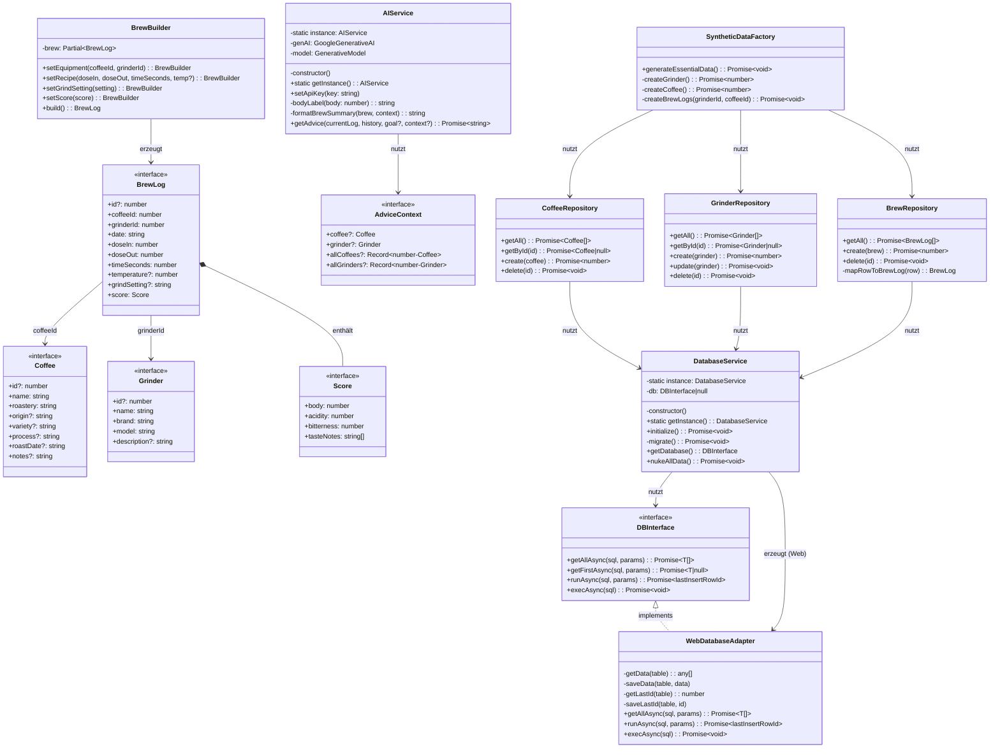
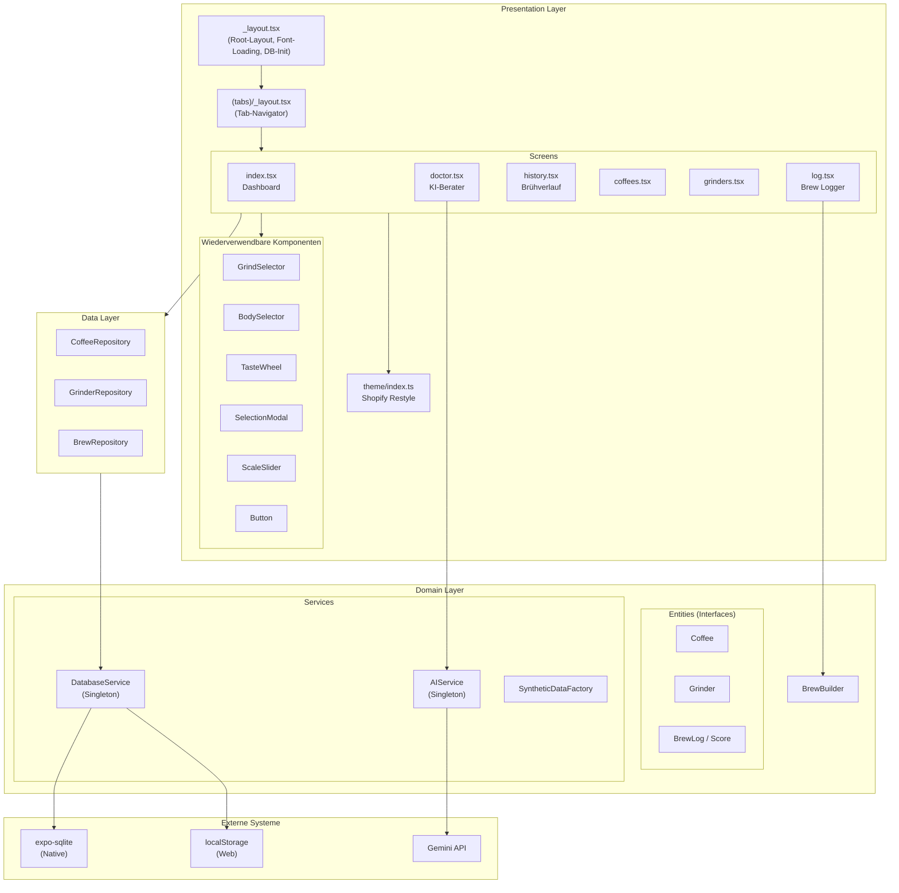
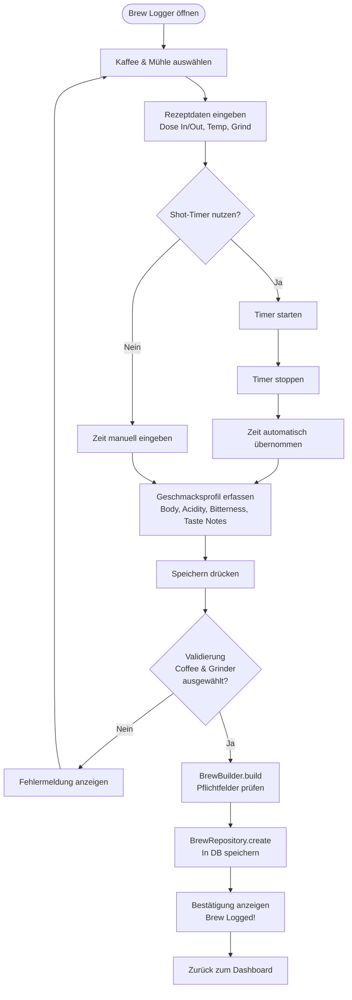
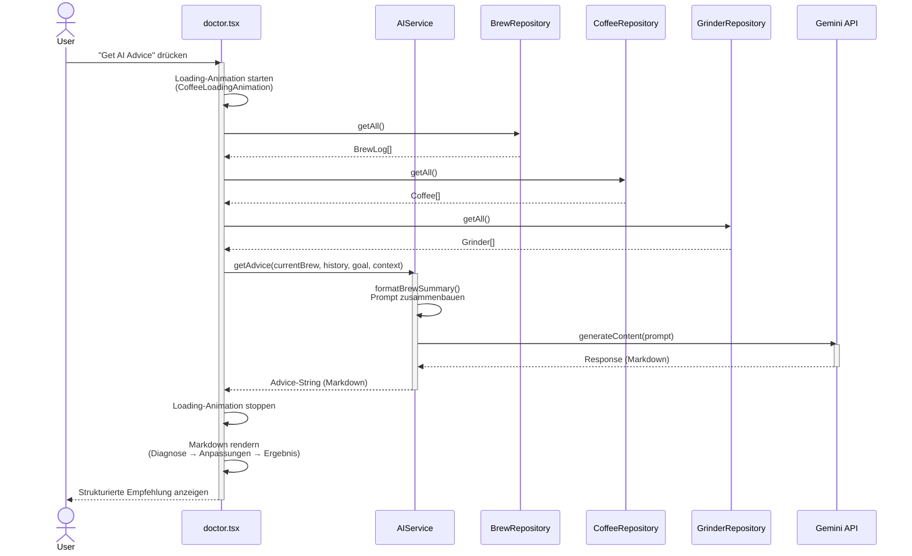

# BrewRef — Specialty Coffee Logging App

**BrewRef** ist eine Cross-Plattform-App (iOS, Android, Web) zum Loggen, Analysieren und Verbessern von Kaffee-Brühvorgängen. Die App folgt dem Designprinzip "Industrial Zen" mit einer dunklen, minimalistischen Ästhetik.

---

## Inhaltsverzeichnis

1. [Technologie-Stack](#technologie-stack)
2. [Projektstruktur](#projektstruktur)
3. [Anforderungen (FR & NFR)](#anforderungen-fr--nfr)
4. [Qualitätsanforderungen](#qualitätsanforderungen)
5. [Architektur und Design Patterns](#architektur-und-design-patterns)
6. [UML-Diagramme](#uml-diagramme)
7. [Umsetzung der UI-Prinzipien](#umsetzung-der-ui-prinzipien)
8. [Installation & Start](#installation--start)

---

## Technologie-Stack

| Komponente | Technologie |
|---|---|
| Framework | Expo SDK 54, React Native 0.81, TypeScript |
| Navigation | Expo Router v6 (dateibasiertes Tab-Layout) |
| Styling / Design System | Shopify Restyle (Theme-basiert) |
| Datenbank | `expo-sqlite` (nativ) / `localStorage`-Adapter (Web) |
| KI-Integration | Google Generative AI (Gemini 3 Flash Preview) |
| Typografie | Inter (UI), JetBrains Mono (Zahlenwerte) via `expo-font` + `@expo-google-fonts` |
| Grafiken | `react-native-svg` (Taste Wheel) |
| Animationen & Haptik | `react-native-reanimated`, `expo-haptics`, React Native `Animated` API |
| Gestensteuerung | `react-native-gesture-handler` (Swipe-to-Delete) |

---

## Projektstruktur

```
Coffee-app/
├── app/                          # Navigation Layer (Expo Router)
│   ├── _layout.tsx               # Root-Layout mit DB-Initialisierung, Font-Loading, Web-Container
│   └── (tabs)/
│       ├── _layout.tsx           # Tab-Navigator (7 Tabs)
│       ├── index.tsx             # Home / Dashboard
│       ├── log.tsx               # Brew Logger
│       ├── history.tsx           # Brühverlauf
│       ├── coffees.tsx           # Kaffee-Verwaltung
│       ├── grinders.tsx          # Mühlen-Verwaltung
│       └── doctor.tsx            # KI-Berater
│
└── src/
    ├── presentation/             # UI-Schicht
    │   ├── theme/index.ts        # Shopify Restyle Theme (Farben, Fonts, Spacing)
    │   ├── components/           # Wiederverwendbare UI-Komponenten
    │   │   ├── GrindSelector     # Scrollbarer Mahlgrad-Selector
    │   │   ├── BodySelector      # Body-Auswahl (Light/Medium/Heavy)
    │   │   ├── TasteWheel        # SVG-Geschmacksrad
    │   │   ├── SelectionModal    # Bottom-Sheet Auswahl-Modal
    │   │   ├── ScaleSlider       # Gradient-Slider (0–10)
    │   │   └── Button            # Theme-basierter Button
    │   └── screens/              # Vollbild-Komponenten
    │       ├── ManageCoffeesScreen
    │       └── ManageGrindersScreen
    │
    ├── domain/                   # Domänen-/Geschäftslogik-Schicht
    │   ├── entities/             # Datenmodelle (Interfaces)
    │   │   ├── Coffee.ts
    │   │   ├── Grinder.ts
    │   │   └── BrewLog.ts        # Inkl. Score-Interface
    │   ├── services/
    │   │   ├── DatabaseService   # Singleton – DB-Verwaltung + WebDatabaseAdapter
    │   │   ├── AIService         # Singleton – Gemini-API
    │   │   └── SyntheticDataFactory # Seed-Daten (Factory)
    │   └── builders/
    │       └── BrewBuilder       # Builder-Pattern für BrewLog
    │
    ├── data/                     # Datenzugriffs-Schicht
    │   └── repositories/
    │       ├── CoffeeRepository
    │       ├── GrinderRepository
    │       └── BrewRepository
    │
    └── utils/
        └── mockData.ts           # Generierung von Testdaten
```

---

## Anforderungen (FR & NFR)

Die App erfüllt **acht funktionale** und **drei nicht-funktionale** Anforderungen:

| ID | Anforderungstyp | Beschreibung |
|---|---|---|
| FA1 | Funktional | **Brew Logging** — Vollständige Erfassung eines Brühvorgangs mit Rezeptdaten (Dose In/Out, Time, Temperature, Grind Setting). Umgesetzt in `log.tsx` und `BrewBuilder`. |
| FA2 | Funktional | **Kaffee-Verwaltung (CRUD)** — Kaffeebohnen anlegen, anzeigen und löschen mit Metadaten (Herkunft, Sorte, Prozess, Röstdatum). Umgesetzt in `ManageCoffeesScreen` und `CoffeeRepository`. |
| FA3 | Funktional | **Mühlen-Verwaltung (CRUD)** — Kaffeemühlen anlegen, anzeigen und löschen mit Marke, Modell und Beschreibung. Umgesetzt in `ManageGrindersScreen` und `GrinderRepository`. |
| FA4 | Funktional | **Brühverlauf** — Chronologische Anzeige aller Brühvorgänge mit Detailansicht (Modal) und Swipe-to-Delete. Umgesetzt in `history.tsx`. |
| FA5 | Funktional | **KI-basierte Brühberatung** — Analyse einzelner Brühvorgänge mit Gemini-KI inkl. Zielformulierung. Strukturierte Antwort (Diagnose → Anpassungen → Ergebnis). Umgesetzt in `doctor.tsx` und `AIService`. |
| FA6 | Funktional | **Shot-Timer** — Integrierter Timer mit Start/Stop/Reset und 0,1-Sekunden-Genauigkeit, automatische Übernahme der gestoppten Zeit. Umgesetzt in `log.tsx`. |
| FA7 | Funktional | **Geschmacksprofil-Erfassung** — Body-Auswahl über 3 Zonen (Light/Medium/Heavy), Acidity/Bitterness-Slider (0–10), und Taste Wheel mit 6 Kategorien und Sub-Notes. Umgesetzt in `BodySelector`, `ScaleSlider` und `TasteWheel`. |
| FA8 | Funktional | **Dashboard mit Statistiken** — Übersichtsseite mit Beans Stashed, Days Since Last Brew, Total Brews, Top Coffee und Last-Brew-Card. Umgesetzt in `index.tsx`. |
| NFA1 | Nicht-funktional | **Cross-Plattform** — Lauffähig auf iOS, Android und Web aus einer Codebasis. `WebDatabaseAdapter` als plattformspezifische Abstraktion für `localStorage`; `Platform.OS`-Abfragen für Layout-Anpassungen (Phone-Frame-Container auf Web, plattformspezifische Dialoge). |
| NFA2 | Nicht-funktional | **Offline-First** — Alle Daten lokal gespeichert (`expo-sqlite` nativ, `localStorage` Web). Keine Internetverbindung für Kernfunktionen nötig; KI-Feature explizit als Online-Feature. |
| NFA3 | Nicht-funktional | **Responsiveness & Performance** — Flüssige UI mit haptischem Feedback (`expo-haptics`), Snap-Animationen (`snapToInterval`, `decelerationRate="fast"`), und Custom Loading-Animationen (Coffee-Cup-Filling via `Animated` API). |

---

## Qualitätsanforderungen

### UI-Konsistenz

- **Globales Theme-System** (`src/presentation/theme/index.ts`): Alle Farben, Abstände, Textvarianten und Font-Familien (Inter, JetBrains Mono) sind zentral über Shopify Restyle definiert. Keine hartcodierten Styles in Screens — alle Komponenten nutzen `Box`, `Text` und `useTheme()`.
- **Einheitliche Kartenstile**: Alle Listenelemente (Brews, Coffees, Grinders) verwenden identische `cardPrimaryBackground`-Farbgebung, `borderRadius`, und Spacing.
- **Konsistente Navigationsstruktur**: Alle Tabs verwenden das gleiche Header-Styling und Tab-Bar-Konfiguration.

### Fehlerfreiheit

- **Validierung**: `BrewBuilder.build()` wirft einen Error bei fehlenden Pflichtfeldern (coffeeId, grinderId, doseIn, doseOut, timeSeconds).
- **Graceful Error Handling**: `DatabaseService.initialize()` fängt Fehler ab und zeigt eine Fehlerseite. `AIService.getAdvice()` fängt API-Fehler und gibt eine fallback-Nachricht zurück.
- **Löschen mit Bestätigung**: `history.tsx` und `doctor.tsx` verwenden plattformspezifische Dialoge (`Alert.alert()` nativ, `confirm()` Web) vor destruktiven Aktionen. Nuke-Funktion nutzt `databaseService.nukeAllData()` für atomares Löschen aller Tabellen.

### Cross-Plattform-Ausführbarkeit

- **Native**: `expo-sqlite` für persistente Datenhaltung, `expo-haptics` für haptisches Feedback.
- **Web**: `WebDatabaseAdapter` als Adapter für `localStorage`; `Platform.OS === 'web'`-Abfragen für Layout-Anpassungen (Phone-Frame-Container, angepasste Tab-Bar-Höhe, deaktivierte Haptics).
- **Universell**: Alle UI-Komponenten verwenden React Native Primitives, die automatisch auf allen Plattformen rendern.

---

## Architektur und Design Patterns

### Schichtenarchitektur (Layered Architecture)

Die App verwendet eine **Drei-Schichten-Architektur** mit strikter Abhängigkeitsrichtung:

```
┌─────────────────────────────────────────┐
│  Presentation Layer (UI)                │
│  app/, src/presentation/                │
│  Screens, Components, Theme, Navigation │
├─────────────────────────────────────────┤
│  Domain Layer (Geschäftslogik)          │
│  src/domain/                            │
│  Entities, Services, Builders           │
├─────────────────────────────────────────┤
│  Data Layer (Datenzugriff)              │
│  src/data/                              │
│  Repositories → DatabaseService         │
└─────────────────────────────────────────┘
```

**Abhängigkeitsrichtung:** Presentation → Domain ← Data. Die Domain-Schicht hat keine Abhängigkeiten zu UI- oder Datenbankdetails (die Entities sind reine Interfaces).

Zusätzlich wird das **Repository-Pattern** als Architekturmuster eingesetzt: `CoffeeRepository`, `GrinderRepository` und `BrewRepository` kapseln sämtliche SQL-Logik und bieten den Screens eine saubere API (`getAll()`, `getById()`, `create()`, `delete()`).

### Design Patterns

Die App setzt **vier** Design Patterns ein:

#### 1. Singleton Pattern

Das Singleton Pattern wurde für die zentrale Ressourcenverwaltung eingesetzt und mithilfe der Klassen `DatabaseService` und `AIService` umgesetzt. Beide verwenden eine private `constructor`-Methode und eine statische `getInstance()`-Methode, die sicherstellt, dass nur eine einzige Instanz existiert. Dies verhindert Ressourcenkonflikte bei Datenbankverbindungen und KI-API-Clients.

```typescript
class DatabaseService {
    private static instance: DatabaseService;
    private constructor() { }
    public static getInstance(): DatabaseService {
        if (!DatabaseService.instance) {
            DatabaseService.instance = new DatabaseService();
        }
        return DatabaseService.instance;
    }
}
export const databaseService = DatabaseService.getInstance();
```

#### 2. Builder Pattern

Das Builder Pattern wurde für die schrittweise Konstruktion komplexer `BrewLog`-Objekte eingesetzt und mithilfe der Klasse `BrewBuilder` umgesetzt. Der Builder bietet eine Fluent-API (`setEquipment()`, `setRecipe()`, `setGrindSetting()`, `setScore()`) und validiert beim Aufruf von `build()` alle Pflichtfelder, bevor das finale Objekt erzeugt wird.

```typescript
const brew = new BrewBuilder()
    .setEquipment(coffeeId, grinderId)
    .setRecipe(18, 36, 30, 93)
    .setGrindSetting('22 Clicks')
    .setScore({ body: 1, acidity: 7, bitterness: 3, tasteNotes: ['Jasmine'] })
    .build(); // Validierung + Datum-Erzeugung
```

#### 3. Adapter Pattern

Das Adapter Pattern wurde für die plattformübergreifende Datenbankabstraktion eingesetzt und mithilfe des Interface `DBInterface` und der Klasse `WebDatabaseAdapter` umgesetzt. Der `WebDatabaseAdapter` implementiert dasselbe Interface wie die native `expo-sqlite`-Instanz, adaptiert die Aufrufe aber auf `localStorage`. Dies ermöglicht es, denselben Repository-Code auf allen Plattformen zu verwenden.

```typescript
interface DBInterface {
    getAllAsync<T>(sql: string, params?: any[]): Promise<T[]>;
    getFirstAsync<T>(sql: string, params?: any[]): Promise<T | null>;
    runAsync(sql: string, params?: any[]): Promise<{ lastInsertRowId: number }>;
    execAsync(sql: string): Promise<void>;
}

class WebDatabaseAdapter implements DBInterface { /* localStorage-Implementierung */ }
```

#### 4. Factory Pattern

Das Factory Pattern wurde für die Erzeugung konsistenter Testdaten eingesetzt und mithilfe der Klasse `SyntheticDataFactory` umgesetzt. Die Methode `generateEssentialData()` erzeugt zusammenhängende Entitäten (Grinder → Coffee → BrewLogs), wobei die Factory sicherstellt, dass alle Foreign Keys korrekt gesetzt sind.

```typescript
class SyntheticDataFactory {
    async generateEssentialData(): Promise<void> {
        const grinderId = await this.createGrinder();   // Comandante C40
        const coffeeId = await this.createCoffee();     // Ethiopia Yirgacheffe
        await this.createBrewLogs(grinderId, coffeeId); // Sample Brews
    }
}
```

---

## UML-Diagramme

### 1. Klassendiagramm



### 2. Komponentendiagramm



### 3. Aktivitätsdiagramm — Brew Logging



### 4. Sequenzdiagramm — KI-Brühberatung



---

## Umsetzung der UI-Prinzipien

Die App setzt alle zehn **Usability-Heuristiken nach Jakob Nielsen** konsequent um:

### 1. Sichtbarkeit des Systemstatus

| Umsetzung | Datei |
|---|---|
| `ActivityIndicator` während DB-Initialisierung und Font-Loading | `_layout.tsx` |
| `RefreshControl` mit Pull-to-Refresh auf Dashboard und History | `index.tsx`, `history.tsx` |
| Shot-Timer zeigt Echtzeit-Sekundenanzeige (0,1s Updates) | `log.tsx` |
| Custom Coffee-Cup-Filling-Animation mit zyklischen Nachrichten während KI-Verarbeitung | `doctor.tsx` (CoffeeLoadingAnimation) |
| "Brew Logged!" / "Data Generated!" Bestätigungsmeldungen | `log.tsx`, `doctor.tsx` |

### 2. Übereinstimmung zwischen System und realer Welt

| Umsetzung | Datei |
|---|---|
| Fachterminologie der Kaffee-Domäne: Dose In/Out, Grind Setting, Body, Acidity, Shot Timer | Alle Logging-Screens |
| Taste Wheel mit branchenüblichen Kategorien (Fruity, Sweet, Nutty, Spiced, Roasted, Floral) | `TasteWheel.tsx` |
| Body-Zonen mit deskriptiven Labels: "WATERY", "TEA-LIKE", "SYRUPY", "VELVETY" | `BodySelector.tsx` |
| GrindSelector als physische Skala (Tick-Lineal) — imitiert reale Mühlen-Einstellung | `GrindSelector.tsx` |

### 3. Benutzerkontrolle und Freiheit

| Umsetzung | Datei |
|---|---|
| Tab-Navigation erlaubt freies Wechseln zwischen allen Bereichen | `(tabs)/_layout.tsx` |
| Modals haben Close-Buttons und Backdrop-Tap zum Schließen | `SelectionModal.tsx`, `history.tsx` |
| Shot-Timer: Start/Stop/Reset — volle Kontrolle über den Timer | `log.tsx` |
| `router.back()` nach Speichern eines Brews | `log.tsx` |
| Löschen von Brews, Coffees, Grinders jederzeit möglich | `history.tsx`, `ManageCoffeesScreen`, `ManageGrindersScreen` |

### 4. Konsistenz und Standards

| Umsetzung | Datei |
|---|---|
| Globales Theme mit einheitlichen Farben, Spacing, Font-Familien und Text-Varianten | `theme/index.ts` |
| Alle Karten verwenden identische `cardPrimaryBackground` + `borderRadius` | Alle Screens |
| Einheitliche Modale (selbes Dark-Theme, gleiche Animationsart `slide`) | `SelectionModal`, `history.tsx`, `ManageCoffeesScreen` |
| Tab-Icons aus konsistenter Icon-Familie (MaterialCommunityIcons) | `(tabs)/_layout.tsx` |
| Swipe-to-Delete auf Coffees UND Grinders gleich implementiert | `ManageCoffeesScreen`, `ManageGrindersScreen` |

### 5. Fehlervermeidung

| Umsetzung | Datei |
|---|---|
| `BrewBuilder.build()` validiert Pflichtfelder vor Speicherung | `BrewBuilder.ts` |
| "Please select Coffee and Grinder"-Warnung bei fehlendem Equipment | `log.tsx` |
| `GrindSelector` mit `snapToInterval` verhindert ungültige Zwischenwerte | `GrindSelector.tsx` |
| Default-Werte für Rezeptfelder (18g in, 36g out, 30s, 93°C) | `log.tsx` |
| Plattformspezifische Bestätigungsdialoge (`Alert.alert()` / `confirm()`) vor Datenlöschung | `history.tsx`, `doctor.tsx` |

### 6. Wiedererkennen statt Erinnern

| Umsetzung | Datei |
|---|---|
| `SelectionModal` zeigt alle verfügbaren Coffees/Grinders als Liste | `SelectionModal.tsx` |
| Ausgewähltes Coffee/Grinder wird im Selector-Feld angezeigt | `log.tsx` |
| Taste Wheel zeigt alle Kategorien visuell auf einen Blick | `TasteWheel.tsx` |
| Body-Selector zeigt alle drei Optionen gleichzeitig mit Deskriptoren | `BodySelector.tsx` |
| History-Cards zeigen Kaffee, Datum, Rezeptdaten und Geschmacksnotizen direkt | `history.tsx` |

### 7. Flexibilität und Effizienz

| Umsetzung | Datei |
|---|---|
| Shot-Timer füllt Zeitfeld automatisch aus | `log.tsx` |
| Pull-to-Refresh auf Dashboard und History für schnelle Aktualisierung | `index.tsx`, `history.tsx` |
| GrindSelector: Scroll mit Snap + manuelle Eingabe möglich | `GrindSelector.tsx` |
| Brew Doctor: Brew-Auswahl + eigene Zielformulierung | `doctor.tsx` |
| Dev Tools: "Generate 50 Mock Brews" für schnelles Testing | `doctor.tsx` |

### 8. Ästhetisches und minimalistisches Design

| Umsetzung | Datei |
|---|---|
| "Industrial Zen"-Farbpalette: Onyx (#0E0E0E), Graphite (#1A1A1A), Espresso-Amber (#D4943A), Bronze (#DBA04D), Sage (#8F9779) | `theme/index.ts` |
| Custom Typografie: Inter (Regular/SemiBold/Bold) für UI, JetBrains Mono für numerische Werte | `theme/index.ts`, `_layout.tsx` |
| Jeder Screen zeigt nur das kontextuell Relevante (keine Überladung) | Alle Screens |
| Dashboard: verdichtete Statistiken in 2×2 Grid + fokussierter Last-Brew-Card | `index.tsx` |
| Web: Phone-Frame-Container (500px, abgerundete Ecken, Schatten) | `_layout.tsx` |
| Sparsamer Einsatz von Farbe — Espresso-Amber nur für aktive/wichtige Elemente | Konsequent im Theme |

### 9. Fehler erkennen, diagnostizieren und beheben

| Umsetzung | Datei |
|---|---|
| "Database Initialization Failed" + Fehlernachricht bei DB-Fehler | `_layout.tsx` |
| "Error saving brew: [Details]" bei Speicherfehler | `log.tsx` |
| "Unable to get advice. Please check your API Key and internet connection." | `AIService.ts` |
| `alert()`-Aufrufe mit konkreten Fehlermeldungen (nicht nur generische Fehler) | Durchgängig |

### 10. Hilfe und Dokumentation

| Umsetzung | Datei |
|---|---|
| KI-Berater (Brew Doctor) gibt kontextbezogene, aktionale Tipps | `doctor.tsx`, `AIService.ts` |
| Markdown-Rendering der KI-Antworten für strukturierte Darstellung | `doctor.tsx` |
| Platzhaltertexte als Hilfestellung ("e.g. More sweetness, less acidity...") | `doctor.tsx` |
| Empty-States mit Handlungsaufforderung ("No brews recorded yet. Start your journey...") | `index.tsx` |
| Deskriptoren in BodySelector erklären die Optionen ("WATERY", "SYRUPY", etc.) | `BodySelector.tsx` |

---

## Installation & Start

### Voraussetzungen

- Node.js ≥ 18
- npm oder yarn
- Expo CLI (optional, `npx expo` funktioniert ebenfalls)

### Installation

```bash
cd Coffee-app
npm install
```

### Start

```bash
# Web
npx expo start --web

# iOS (Simulator oder Gerät)
npx expo start --ios

# Android (Emulator oder Gerät)
npx expo start --android
```
